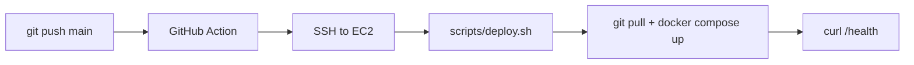

# CI/CD — Phase 6

Automatic deploy to EC2 when app code is pushed to `main`.

## How it works



1. You push changes to `backend/`, `frontend/`, `scripts/`, or `docker-compose.prod.yml`
2. GitHub Actions SSHs into your EC2 instance
3. Runs `scripts/deploy.sh` (pull + rebuild containers)
4. Verifies `http://<host>/health` responds

Manual deploy: **Actions → Deploy to EC2 → Run workflow**

## One-time setup

### 1. EC2 must be running

```bash
cd terraform
terraform apply
terraform output public_ip
```

### 2. Add GitHub repository secrets

Go to **GitHub → your repo → Settings → Secrets and variables → Actions → New repository secret**

| Secret | Value | Required |
|--------|-------|----------|
| `DEPLOY_HOST` | EC2 Elastic IP, e.g. `54.145.213.205` | Yes |
| `DEPLOY_USER` | `ec2-user` | Yes |
| `DEPLOY_SSH_KEY` | Full contents of `terraform/keys/connectx-scripts-key.pem` | Yes |

To copy the private key:

```bash
cat terraform/keys/connectx-scripts-key.pem
```

Paste the entire file including `-----BEGIN` / `-----END` lines into `DEPLOY_SSH_KEY`.

### 3. EC2 security group must allow SSH from GitHub

GitHub Actions runners use dynamic IPs. For personal dev, ensure port **22** is open (Terraform default: `0.0.0.0/0`).

For production, restrict SSH to [GitHub Actions IP ranges](https://api.github.com/meta) or use a self-hosted runner in your VPC.

### 4. Push this workflow to `main`

```bash
git add .github/workflows/deploy.yml docs/CI.md
git commit -m "Add GitHub Actions EC2 deploy"
git push origin main
```

The first push that includes app path changes will trigger a deploy (if secrets are set).

## Day-to-day workflow

```bash
# Make changes locally
git add .
git commit -m "your change"
git push origin main
# → Action deploys automatically (~3–8 min)
```

Watch progress: **GitHub → Actions → Deploy to EC2**

## What does NOT trigger deploy

Pushes that only change:

- `terraform/**`
- `docs/**`
- `README.md`
- `.github/workflows/deploy.yml` alone

Use **Run workflow** manually after infra-only changes, or SSH deploy:

```bash
ssh -i terraform/keys/connectx-scripts-key.pem ec2-user@$(cd terraform && terraform output -raw public_ip) \
  '/opt/connectx-scripts/scripts/deploy.sh'
```

## Troubleshooting

| Issue | Fix |
|-------|-----|
| `Permission denied (publickey)` | Check `DEPLOY_SSH_KEY` matches the EC2 key pair |
| `connection timed out` | EC2 stopped, wrong IP, or SSH blocked in security group |
| Deploy script not found | EC2 not bootstrapped — run `terraform apply` or clone repo manually |
| Health check fails | Wait for Docker build; check `docker compose logs api` on EC2 |
| Action skipped | Push didn't touch `backend/`, `frontend/`, `scripts/`, or `docker-compose.prod.yml` |

## After `terraform destroy` / new EC2

1. `terraform apply` (new IP)
2. Update `DEPLOY_HOST` secret with new Elastic IP
3. Re-run workflow or push a change
